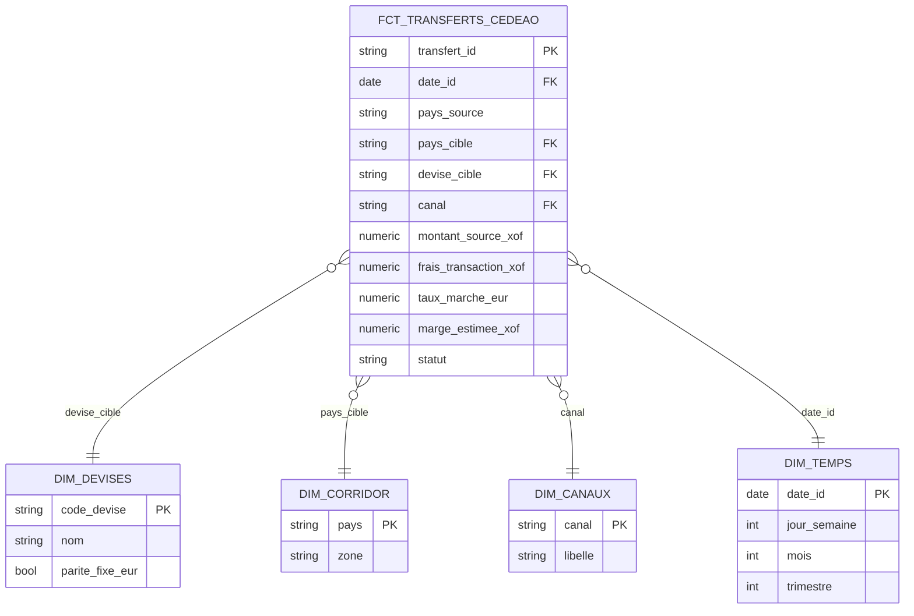

# Schéma en étoile

Grain de la table de faits : **un transfert individuel**.

## Pourquoi ce découpage

- `dim_devises` porte le flag `parite_fixe_eur`, qui sépare les corridors sans risque de change (XOF -> XOF) de ceux avec risque réel (XOF -> NGN, XOF -> GHS). C'est le cœur de la problématique, d'où une colonne explicite plutôt qu'une déduction refaite à chaque requête.
- `dim_corridor` reste simple (pays + zone), ce qui suffit à répondre aux questions métier retenues.
- Pas de dimension `dim_client` : les transferts sont anonymes, aucune donnée utilisateur n'est collectée.
